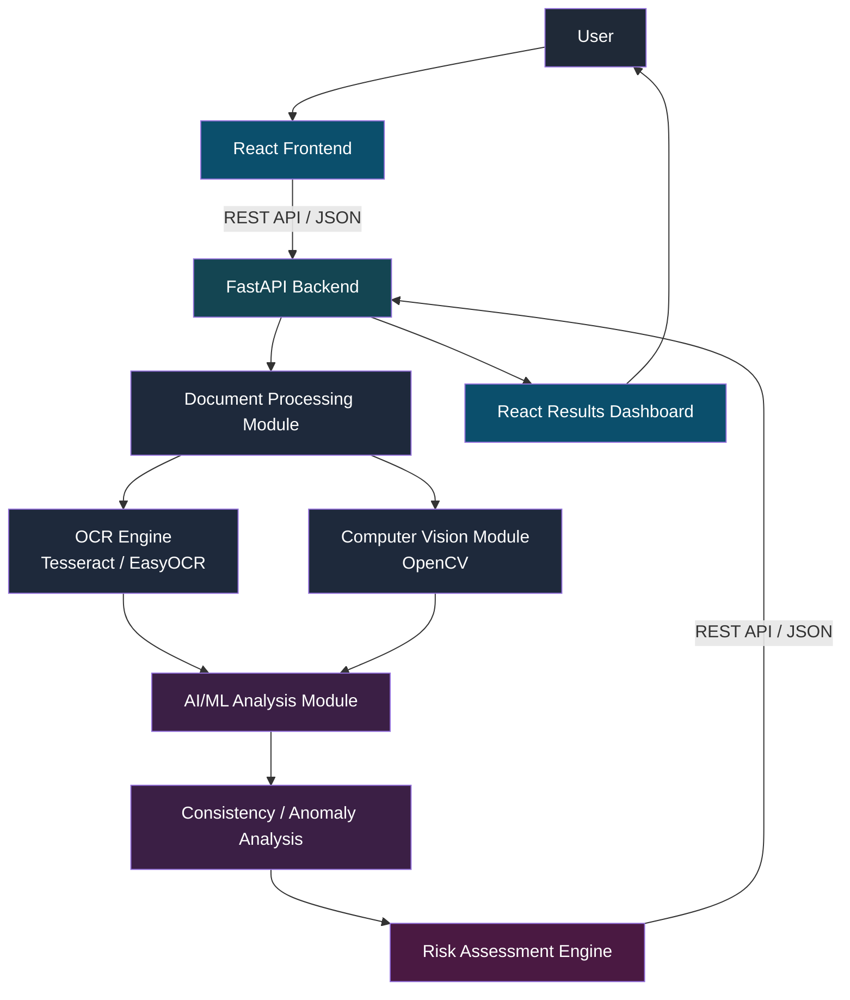

<p align="center">
  
</p>

<h1 align="center">🔐 AI-Based Fake Identity & Document Screening System</h1>

<p align="center">
  <b>AI • OCR • Computer Vision • Risk Intelligence</b>
</p>

<p align="center">
  <i>An AI-assisted screening platform that flags potentially fake, manipulated, or inconsistent identity documents — built for Smart India Hackathon 2026.</i>
</p>

<p align="center">
  
  
  
  
  
  
  
  
</p>

<p align="center">
  <a href="#problem-statement">Problem</a> •
  <a href="#project-overview">Overview</a> •
  <a href="#key-features">Features</a> •
  <a href="#system-architecture">Architecture</a> •
  <a href="#installation">Installation</a> •
  <a href="#project-status">Status</a>
</p>

---

## Problem Statement

Identity documents — ID cards, licenses, certificates, and similar records — are verified manually in most institutional workflows today. This approach carries structural weaknesses:

- **Slow at scale.** Manual review does not scale to high volumes without proportionally increasing staff.
- **Inconsistent.** Judgment varies between reviewers and across review sessions.
- **Fatigue-prone.** Subtle manipulation (font mismatches, tampered fields, inconsistent metadata) is easy to miss after repeated review.
- **Reactive, not preventive.** Fraudulent documents are often caught only after damage is done, not at the point of submission.

A first-pass, AI-assisted screening layer can help human reviewers focus attention where it matters most — without replacing their judgment.

---

## Project Overview

**AI-Based Fake Identity & Document Screening System** is a prototype platform that accepts an uploaded identity document, extracts its content, analyzes it for visual and informational inconsistencies, and produces a structured, explainable risk assessment.

> ⚠️ **This system provides AI-assisted screening and does not independently establish document fraud.** It is designed to support human reviewers, not replace them.

The system combines three analytical layers:

1. **OCR & text extraction** — reads structured fields from the document.
2. **Computer vision analysis** — inspects the document image for visual irregularities.
3. **AI/ML consistency analysis** — checks whether extracted data and visual signals align with expected patterns.

The output is a risk level (`LOW` / `MEDIUM` / `HIGH`) with supporting reasons, intended to guide — not dictate — further verification.

---

## Objectives

- Build an end-to-end pipeline: upload → processing → analysis → risk output.
- Demonstrate practical integration of OCR, computer vision, and ML in one workflow.
- Present results through a clear, human-readable dashboard rather than a raw score.
- Keep every claim about the system's capability honest and verifiable.
- Produce a codebase that is extensible for future SIH evaluation rounds.

---

## Key Features

| Feature | Description | Status |
|---|---|---|
| Document upload interface | Drag-and-drop / file-picker upload of identity documents via React frontend | 🟡 Prototype / In Development |
| Image preprocessing | Noise reduction, contrast normalization, and orientation correction before analysis | 🟡 Prototype / In Development |
| OCR field extraction | Extracts text fields (name, DOB, ID number, etc.) using Tesseract / EasyOCR | 🟡 Prototype / In Development |
| Computer vision checks | Detects visual irregularities such as font inconsistency or tampering artifacts | 🔵 Planned |
| AI/ML anomaly analysis | Learns patterns from extracted features to flag inconsistencies | 🔵 Planned |
| Consistency cross-checks | Compares extracted fields against expected formats and internal document logic | 🔵 Planned |
| Risk scoring & explanation | Produces a risk level with human-readable reasons, not just a number | 🔵 Planned |
| Results dashboard | React-based dashboard displaying risk level, signals, and recommendation | 🟡 Prototype / In Development |
| REST API backend | FastAPI service exposing screening endpoints in JSON | 🟡 Prototype / In Development |

---

## System Workflow

```
Upload → Validation → Preprocessing → OCR → Field Extraction
   → Computer Vision Analysis → AI/ML Analysis
   → Consistency Analysis → Risk Assessment → Dashboard
```

| Stage | Description |
|---|---|
| **Upload** | User submits a document image via the React frontend. |
| **Validation** | Backend checks file type, size, and basic integrity before processing. |
| **Preprocessing** | Image is normalized (denoising, contrast, deskewing) for reliable downstream analysis. |
| **OCR** | Text is extracted from the document image. |
| **Field Extraction** | Raw OCR text is parsed into structured fields (e.g. name, DOB, document ID). |
| **Computer Vision** | The document image is inspected for visual anomalies independent of text content. |
| **AI/ML Analysis** | Extracted features are analyzed for patterns associated with inconsistency or manipulation. |
| **Consistency Analysis** | Cross-field and format checks are applied to the extracted data. |
| **Risk Assessment** | Findings are aggregated into a risk level with supporting reasons. |
| **Dashboard** | The result is rendered for the reviewer in a readable format. |

---

## System Architecture



All communication between the frontend and backend happens over a **REST API using JSON**, with document uploads sent as `multipart/form-data`.

---

## Technology Stack

| Technology | Purpose | Why It Is Used |
|---|---|---|
| **React** | Frontend UI (upload, dashboard) | Component-based structure suits a multi-stage upload → results flow; large ecosystem for rapid hackathon development |
| **JavaScript** | Frontend logic | Native language of the React ecosystem |
| **FastAPI** | Backend REST API | High-performance async Python framework with automatic OpenAPI docs, ideal for ML-backed services |
| **Python** | Backend & AI/ML runtime | De facto standard for AI/ML, OCR, and computer-vision tooling |
| **Tesseract / EasyOCR** | OCR text extraction | Mature, open-source OCR engines with strong community support and no licensing cost |
| **OpenCV** | Image preprocessing & computer vision | Industry-standard library for image manipulation and visual feature analysis |
| **scikit-learn** | Classical ML models | Well-suited for structured/tabular feature analysis and fast prototyping |
| **PyTorch** | Deep learning (if required) | Flexible framework for more complex vision/ML models as the project matures |
| **SQLite / PostgreSQL** | Data persistence | SQLite for local development simplicity; PostgreSQL as a production-ready upgrade path |
| **REST API + JSON** | Frontend–backend communication | Simple, stateless, framework-agnostic communication standard |
| **Git & GitHub** | Version control & collaboration | Industry-standard collaborative workflow for a multi-person team |

---

## Repository Structure

```
AI-Fake-Identity-Screening/
├── frontend/              # React application (upload UI, results dashboard)
├── backend/               # FastAPI application, REST endpoints
├── ai/                    # ML models, training/inference scripts, risk scoring logic
├── document_processing/   # OCR and computer vision pipelines
├── tests/                 # Unit, integration, and API tests
├── docs/                  # Design docs, diagrams, API specifications
├── sample_data/           # Synthetic/anonymized sample documents for testing
├── README.md              # Project documentation (this file)
├── requirements.txt       # Python dependencies
└── .gitignore             # Ignored files and directories
```

---

## Team Roles

| Role | Responsibilities |
|---|---|
| **Problem & Domain Lead** | Research, requirements gathering, fraud scenario mapping, existing-solution analysis |
| **AI/ML Lead** | Model design, anomaly/fraud detection logic, risk scoring, model evaluation |
| **Document Processing + OCR/CV Lead** | Image preprocessing, OCR integration, field extraction, document analysis |
| **Backend + Integration Lead** | FastAPI services, REST API design, database, AI/OCR integration |
| **Frontend + UI/UX Lead** | React app, upload workflow, results dashboard, UI/UX design |
| **Testing + Research + Presentation Lead** | Testing, metrics tracking, documentation, presentation deck, demo, Q&A prep |

---

## API/Data Flow

The frontend communicates with the backend exclusively through a REST API. Documents are uploaded using `multipart/form-data`; all other exchanges use JSON.

**Endpoint:**

```
POST /api/v1/screen
Content-Type: multipart/form-data
```

**Request:**

```
file: <document_image>
```

**Example Response:**

```json
{
  "request_id": "example-request-id",
  "status": "completed",
  "document_type": "REDACTED_EXAMPLE",
  "extracted_fields": {
    "name": "REDACTED_EXAMPLE",
    "date_of_birth": "REDACTED_EXAMPLE",
    "document_id": "REDACTED_EXAMPLE"
  },
  "risk_assessment": {
    "risk_level": "MEDIUM",
    "risk_score": null,
    "signals": [
      "Font inconsistency detected in date field",
      "OCR confidence below expected threshold"
    ],
    "recommendation": "Recommend manual verification"
  }
}
```

> `risk_score` is shown as `null` here because numeric scoring is not yet implemented — see [Project Status](#project-status).

---

## AI/ML Pipeline


Candidate approaches under consideration (none finalized or trained yet):

- **Classical ML (scikit-learn):** models such as logistic regression, random forests, or gradient boosting over engineered features (field format validity, OCR confidence, cross-field consistency).
- **Deep learning (PyTorch):** for image-level anomaly detection if classical features prove insufficient, e.g. a CNN-based tamper detector.
- **Rule-based checks as a baseline:** deterministic consistency rules (date formats, checksum patterns) to complement learned models, particularly useful before a labeled dataset is available.

No model has been trained or benchmarked yet. This section describes the intended design space, not implemented results.

---

## OCR & Document Processing Pipeline


- **OpenCV** handles preprocessing: grayscale conversion, denoising, adaptive thresholding, and deskewing to improve OCR accuracy on real-world (non-studio-quality) document photos.
- **Tesseract / EasyOCR** perform the actual text extraction. EasyOCR is being evaluated as an alternative/complement to Tesseract for documents with irregular fonts or layouts.
- **Field extraction** parses raw OCR output into structured key-value fields using positional and pattern-based heuristics.

---

## Risk Assessment

The system is designed to output:

| Component | Description |
|---|---|
| **Risk Level** | One of `LOW`, `MEDIUM`, `HIGH` |
| **Risk Score** | A numeric score, *if implemented* — not guaranteed in the current prototype stage |
| **Detected Signals** | Specific anomalies found (e.g. OCR confidence issues, visual inconsistencies) |
| **Reasons** | Human-readable explanation of why a given risk level was assigned |
| **Recommendation** | Suggested next step, e.g. "proceed" or "recommend manual verification" |

> ⚠️ **The risk assessment is a screening aid.** It highlights signals worth a human reviewer's attention and does **not** prove that a document is fraudulent.

---

## Testing & Evaluation Metrics

| Testing Type | Purpose |
|---|---|
| **Unit Testing** | Verify individual functions (preprocessing steps, field parsers, scoring logic) |
| **Integration Testing** | Verify OCR → CV → ML pipeline works together correctly |
| **API Testing** | Verify FastAPI endpoints return correct structure and status codes |
| **End-to-End / System Testing** | Verify the full upload → dashboard flow |
| **Model Evaluation** | Assess ML model quality once training data and a trained model exist |

**Candidate metrics** (not yet measured — no results exist at this stage):

- Accuracy, Precision, Recall, F1-score (classification quality)
- False Positive Rate (critical for a screening tool)
- OCR Character/Word Error Rate (CER/WER)
- End-to-end processing time per document

No numerical results are reported in this README, as none have been produced yet.

---

## Installation

```bash
# 1. Clone the repository
git clone [Add GitHub repository URL]
cd AI-Fake-Identity-Screening

# 2. Set up Python virtual environment
python -m venv venv
source venv/bin/activate      # Windows: venv\Scripts\activate

# 3. Install backend/AI dependencies
pip install -r requirements.txt

# 4. Install frontend dependencies
cd frontend
npm install
cd ..
```

---

## How to Run

**Backend (FastAPI):**

```bash
cd backend
uvicorn main:app --reload
```

**Frontend (React):**

```bash
cd frontend
npm start
```

The frontend will typically run on `http://localhost:3000` and the backend on `http://localhost:8000`, depending on configuration.

---

## Example Usage

1. User uploads a sample identity document image through the React interface.
2. The backend validates the file and begins processing.
3. OCR extracts fields such as name, date of birth, and document ID (shown as `REDACTED_EXAMPLE` in all documentation).
4. Computer vision and AI/ML modules analyze the document for inconsistencies.
5. A risk assessment (e.g. `MEDIUM`, with signals like "font inconsistency detected") is generated.
6. The dashboard displays the result along with a recommendation for further action.

---

## Screenshots / Demo

| View | Preview |
|---|---|
| Upload Interface | [Add upload interface screenshot here] |
| Processing View | [Add processing screenshot here] |
| Results Dashboard | [Add results dashboard screenshot here] |
| Architecture Diagram | [Add architecture diagram here] |
| Demo Video | [Add demo video link here] |

---

## Future Scope

- Train and evaluate ML models on a proper labeled/synthetic dataset.
- Expand computer vision checks to cover more document types and tampering patterns.
- Add authentication and role-based access control for production use.
- Introduce audit logging for reviewer decisions.
- Explore multilingual OCR support for regional identity documents.
- Add a numeric, calibrated risk score alongside the categorical risk level.

---

## Limitations

- This is a **student hackathon prototype**, not a production-ready or certified system.
- No ML model has been trained yet; anomaly detection logic is currently conceptual.
- OCR accuracy depends heavily on image quality and is not guaranteed for all document types.
- The system does not verify documents against any government or authoritative database.
- Risk output is a decision-support signal, not a legal or definitive fraud determination.

---

## Security & Privacy

Identity documents contain sensitive personal information. This project follows these principles:

- **Never commit real documents** or real personal data to this repository.
- Use only **synthetic or anonymized sample data** in `sample_data/`.
- **Do not hardcode secrets** (API keys, database credentials) — use environment variables.
- **Delete temporary uploads** after processing where appropriate.
- **Restrict access** to uploaded documents and processing results.
- Use **HTTPS** for all communication in any production deployment.
- Add **authentication and authorization** before any production or public deployment.
- **Avoid logging** sensitive document contents in plaintext.

> This repository, as a hackathon prototype, has not undergone formal security auditing or certification.

---

## Development / Contribution Workflow

```bash
# Create a feature branch
git checkout -b feature/<feature-name>

# Stage and commit changes
git add .
git commit -m "Describe your change"

# Push the branch
git push origin feature/<feature-name>
```

**Workflow:** `Pull Request → Review → Testing → Merge`

**Suggested branch names:**

- `feature/frontend`
- `feature/backend`
- `feature/ocr`
- `feature/computer-vision`
- `feature/ai-model`
- `feature/testing`

---

## Team

| Role | Name |
|---|---|
| Problem & Domain Lead | [Add team member name] |
| AI/ML Lead | [Add team member name] |
| Document Processing + OCR/CV Lead | [Add team member name] |
| Backend + Integration Lead | [Add team member name] |
| Frontend + UI/UX Lead | [Add team member name] |
| Testing + Research + Presentation Lead | [Add team member name] |

---

## Project Status

| Area | Status |
|---|---|
| Research | 🟢 Implemented |
| Architecture | 🟢 Implemented |
| Frontend | 🟡 In Development |
| Backend | 🟡 In Development |
| OCR | 🟡 In Development |
| Computer Vision | 🔵 Planned |
| AI/ML | 🔵 Planned |
| Risk Assessment | 🔵 Planned |
| Testing | 🔵 Planned |
| Documentation | 🟡 In Development |

---

## License

This project is licensed under the [MIT License](LICENSE).

---

## Disclaimer

> ⚠️ This project is a **student prototype developed for Smart India Hackathon 2026**. It is an AI-assisted screening tool and does **not** independently confirm document authenticity or fraud. It has no affiliation, certification, or integration with any government identity system. All example data, API responses, and identifiers shown in this README are fictional placeholders and do not represent real individuals or documents.
